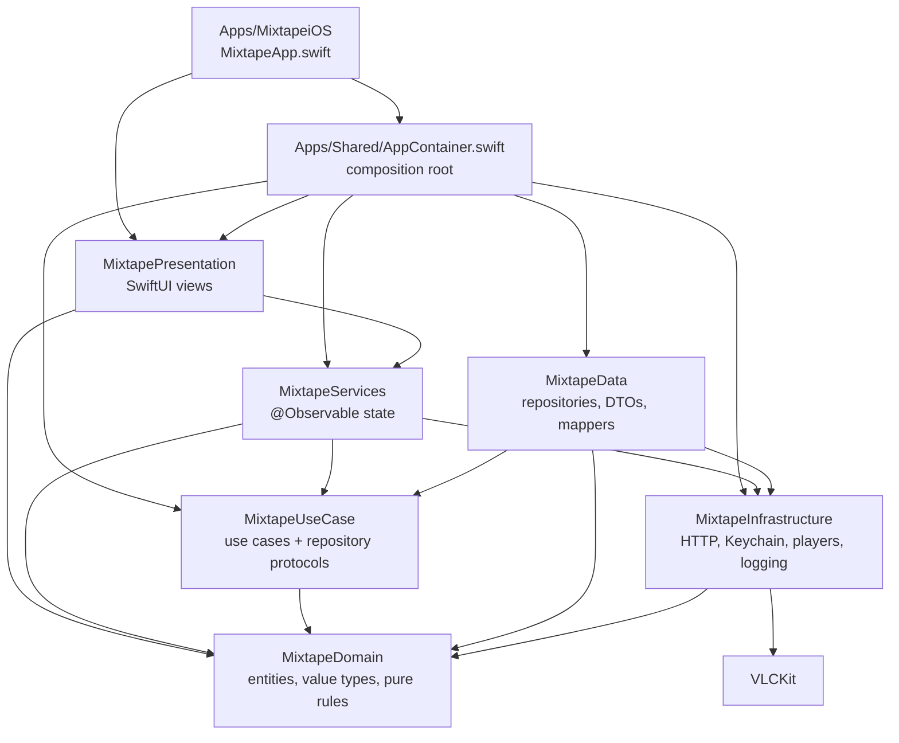
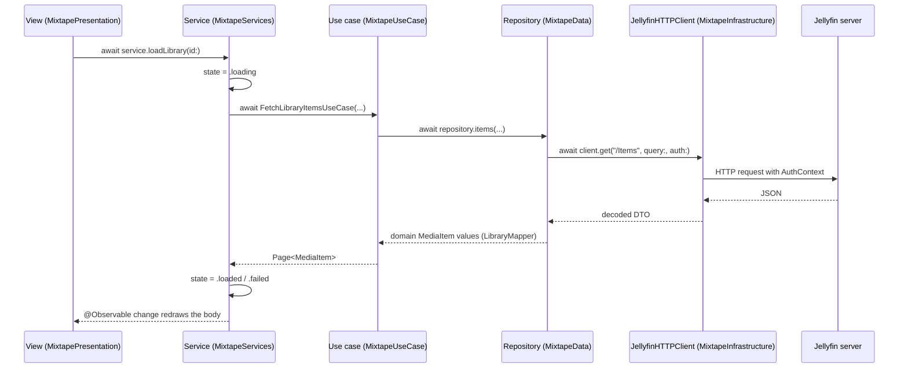

# mixtape — iOS architecture

mixtape is a Jellyfin client for iOS. It connects to one self-hosted Jellyfin server, browses that server's movie, TV and music libraries, plays video and audio, and reports playback progress back to the server.

This document describes the architecture as built. `../jellyfin-openapi.json` is the API contract it is built against — the OpenAPI 3.0.1 specification served by the Jellyfin 10.11.11 instance the project targets, pulled from that server's own `/api-docs/openapi.json`.

## Platform and toolchain

| Item | Value |
|---|---|
| Deployment target | iOS 26.1 (`IPHONEOS_DEPLOYMENT_TARGET = 26.1`, `.iOS("26.1")` in `MixtapeKit/Package.swift`) |
| Toolchain | Xcode 26, Swift 6.2 (`swift-tools-version: 6.2`) |
| Swift language mode | 6 |
| Third-party dependency | VLCKit (`vlckit-spm` 3.6.0), pinned exactly, linked dynamically and reached from one infrastructure type |
| App target | `Apps/MixtapeiOS` — `MixtapeApp.swift`, an asset catalogue and `Info.plist`, nothing else |
| Info.plist | `UIBackgroundModes` = `audio`; `NSAppTransportSecurity.NSAllowsArbitraryLoads` = true, because a LAN Jellyfin server on plain HTTP is the normal case; `NSLocalNetworkUsageDescription` |
| Project format | `MixTape.xcodeproj` at `objectVersion = 77` |

## Swift settings — the two toggles that shape the code

Two build settings decide how almost every type in this codebase is written. They are set at the Xcode project level and repeated per SPM target so the package builds the same way on its own.

| Setting | Value | Where |
|---|---|---|
| `SWIFT_DEFAULT_ACTOR_ISOLATION` | `MainActor` | `MixTape.xcodeproj` project level and the iOS app target |
| `SWIFT_APPROACHABLE_CONCURRENCY` | `NO` | `MixTape.xcodeproj` project level and the iOS app target |
| `SWIFT_VERSION` | `6.0` | `MixTape.xcodeproj` project level and the iOS app target |
| `SWIFT_UPCOMING_FEATURE_MEMBER_IMPORT_VISIBILITY` | `YES` | the iOS app target |
| `.defaultIsolation(MainActor.self)` | — | every one of the six library targets in `MixtapeKit/Package.swift` |
| `.swiftLanguageMode(.v6)` | — | every one of the six library targets in `MixtapeKit/Package.swift` |

### What `SWIFT_DEFAULT_ACTOR_ISOLATION = MainActor` buys the MV architecture

Every type is `@MainActor` unless it says otherwise. That is what makes an MV architecture without a ViewModel layer cheap to write:

- SwiftUI views need no isolation annotation. They are already on the main actor.
- The `@Observable` service classes that hold all mutable state need no `@MainActor` attribute either. `SessionService`, `LibraryService`, `SeriesService`, `ImageService`, `VideoPlaybackService` and `MusicPlayerService` are each written as a plain `@Observable public final class`, and the setting supplies the isolation that keeps their `private(set)` state safe to read straight from a view body.
- The layers that must be free of the main actor opt **out** explicitly, one type at a time, with `nonisolated`. Every DTO, every mapper and every repository in `MixtapeKit/Sources/MixtapeData` carries it — for example `public nonisolated struct JellyfinLibraryRepository`, `nonisolated struct BaseItemDTO`, `nonisolated enum LibraryMapper` — as do the value types in `MixtapeKit/Sources/MixtapeDomain` and the `Sendable` helpers in `MixtapeKit/Sources/MixtapeInfrastructure` such as `KeychainStore` and `AuthContext`.

The direction of that default is the whole point: isolation is the norm, and leaving it is a deliberate, visible act at the type that does so.

### What Swift 6 language mode buys

Language mode 6 makes data-race checking complete for the whole build, so `SWIFT_STRICT_CONCURRENCY` is not set anywhere — the language mode already implies it. Consequences visible throughout the code:

- Everything crossing an isolation boundary is `Sendable`. Domain entities and value types are `Sendable` structs and enums with no reference types at all.
- Repositories are stateless `nonisolated` `Sendable` structs, so a use case can call one from any context.
- `SWIFT_APPROACHABLE_CONCURRENCY = NO` keeps the Swift 6.2 upcoming-feature bundle off, `NonisolatedNonsendingByDefault` among them. A `nonisolated async` function — every repository method — therefore runs on the global concurrent executor when a main-actor service awaits it, and that hop is why repositories, and everything they take or return, are `Sendable`.
- Main-actor code leaves the main actor only where it says so. `@concurrent` appears exactly once in the codebase, on `private nonisolated static func decode(_ data: Data) async -> UIImage?` in `MixtapeKit/Sources/MixtapeServices/Images/ImageService.swift` — the one place in the browse path where real CPU work happens.

## The MV rule

There is no ViewModel layer.

- `@Observable` service classes hold state. They are the only place state is written.
- Views read that state through `@Environment` and call service methods to act.
- Views take no use case and no repository in their signatures. A view that needs data shaped differently is a service's job, not the view's.
- The object graph is built once, by hand, in `Apps/Shared/AppContainer.swift`. No container, no service locator, no `.shared`.
- Environment wiring uses `@Entry`, one small extension per service in `MixtapeKit/Sources/MixtapePresentation/Environment/`.

## Six targets, one direction

`MixtapeKit` is one local SPM package with six library targets. The dependency edges are declared in `MixtapeKit/Package.swift`, so the compiler enforces them, and `scripts/check-layer-imports.sh` is a backstop for the rules a manifest cannot express.

| Target | Holds | Depends on |
|---|---|---|
| `MixtapeDomain` | Entities, value types, domain errors, pure rules | Foundation only |
| `MixtapeUseCase` | One type per use case, repository protocols | `MixtapeDomain` |
| `MixtapeInfrastructure` | HTTP client, Keychain, logging, the AVPlayer and VLCKit player controllers, the audio session | `MixtapeDomain`, VLCKit |
| `MixtapeData` | Repository implementations, DTOs, DTO-to-domain mapping | `MixtapeUseCase`, `MixtapeDomain`, `MixtapeInfrastructure` |
| `MixtapeServices` | `@Observable` state holders | `MixtapeUseCase`, `MixtapeDomain`, `MixtapeInfrastructure` |
| `MixtapePresentation` | SwiftUI views | `MixtapeServices`, `MixtapeDomain` |



`MixtapePresentation` never imports `MixtapeData`, `MixtapeUseCase` or `MixtapeInfrastructure`. `MixtapeUseCase` and `MixtapeDomain` never import SwiftUI, Observation, UIKit or AVFoundation. `AppContainer.swift` is the one file that sees all six layers, and `scripts/check-layer-imports.sh` exempts only that path.

### Why `MixtapeServices` sees `MixtapeInfrastructure`

`VideoPlaybackService` owns a `VideoPlayerControlling` and `MusicPlayerService` owns an `AudioPlayerControlling`. Both protocols live in `MixtapeKit/Sources/MixtapeInfrastructure/`, and `VideoPlayerControlling.makeView() -> AnyView` pins that protocol to a module importing SwiftUI, so it cannot sit lower in the stack. `SPEC-DECISIONS.md` decision 36 records the edge.

## Runtime flow

One request, from a tap to the wire and back into observable state.



Views never see a DTO. `MixtapeData` maps every Jellyfin response into `MixtapeDomain` values at the repository boundary, and `LoadState<Value>` in `MixtapeDomain` carries idle, loading, loaded and failed uniformly so every screen renders the same four states.

## Composition root

`Apps/Shared/AppContainer.swift` builds the graph in one pass — client, then Keychain store, then repositories, then use cases, then services — and `Apps/MixtapeiOS/MixtapeApp.swift` injects the six services into the environment:

```swift
@main
struct MixtapeApp: App {
    @State private var container = AppContainer()

    var body: some Scene {
        WindowGroup {
            RootScreen()
                .environment(\.sessionService, container.sessionService)
                .environment(\.libraryService, container.libraryService)
                .environment(\.seriesService, container.seriesService)
                .environment(\.imageService, container.imageService)
                .environment(\.videoPlaybackService, container.videoPlaybackService)
                .environment(\.musicPlayerService, container.musicPlayerService)
        }
    }
}
```

The container also wires session teardown. `SessionService` holds no reference to the other services; it exposes an `onSessionEnded` closure, and the root — the only place all six are visible — fans sign-out out to the library, series, music and video services so each clears its own caches and stops its own player.

## Services

Every service is an `@Observable public final class` with `private(set)` state.

| Service | State it owns |
|---|---|
| `SessionService` | `state` (loading, signedOut, signedIn), `serverIdentity`, `quickConnect`, `error`, `isBusy`. The only writer of session state and the single handler of an expired session |
| `LibraryService` | `libraries`, `continueWatching`, a per-library page cache, per-item details and per-album track lists. Pages of 60 items, advanced by `startIndex` |
| `SeriesService` | Per-series season lists and per-season episode lists |
| `ImageService` | Poster, backdrop and album-art URLs plus an in-memory `NSCache` capped at 120 MB |
| `VideoPlaybackService` | The current `item`, `plan`, `status`, `position` and `duration`, and the `VideoPlayerControlling` chosen from the plan through an injected factory |
| `MusicPlayerService` | `album`, `queue`, `currentIndex`, `status`, `position`, `finishedAlbumID` |

### The queue is the album

`MusicPlayerService.queue` holds the tracks of exactly one album. `play(album:tracks:startingAt:)` is the only way tracks enter it, and it replaces the queue. When the last track ends, playback stops, the now-playing surface dismisses, and the wallet pages back to the sleeve the album came from and pulses it home. `claimFinish(albumID:)` and `acknowledgeFinish()` hand that navigational event to whichever wallet is on screen.

## Presentation

Views live in `MixtapeKit/Sources/MixtapePresentation/Screens/<Feature>/`, one view per file, filename matching the type. Cross-screen pieces sit in `Shared/`. Some screens live in files suffixed `+iOS`, wrapped in `#if os(iOS)`, rather than branching inside a body.

`RootScreen` switches on `SessionService.state`: `SplashScreen` while restoring, `SignInFlow` when signed out, `RootTabScreen` when signed in. `RootTabScreen` carries four tabs — Home, Libraries, Music, Settings — with the mini player docked in the tab bar's bottom accessory whenever music is active, and `NowPlayingScreen` presented as a sheet from that root so it outlives the mini player.

Chrome is Liquid Glass through one modifier. `MixtapeKit/Sources/MixtapePresentation/Shared/GlassChrome.swift` reads `\.accessibilityReduceTransparency` and paints an opaque `.background` instead of `.glassEffect` when the setting is on; every glass surface goes through it, and `scripts/check-glass-fallback.sh` checks that.

Every screen carries accessibility identifiers, held as constants in `MixtapeKit/Sources/MixtapePresentation/Identifiers/` — one file per screen.

Every view file has a `#Preview` for its loaded, empty and failure states, driven by `Mock*` types that ship in `MixtapeServices` for exactly that purpose.

## The Jellyfin API surface

These are the endpoints the app calls. Everything else in `../jellyfin-openapi.json` is contract the app does not touch.

| Endpoint | Method | Used for |
|---|---|---|
| `/System/Info/Public` | GET | Validate a server URL, read its name and id |
| `/QuickConnect/Enabled` | GET | Whether the server offers Quick Connect |
| `/QuickConnect/Initiate` | POST | Start a Quick Connect handshake, get the code |
| `/QuickConnect/Connect` | GET | Poll until the code is authorised |
| `/Users/AuthenticateByName` | POST | Username and password sign-in |
| `/Users/AuthenticateWithQuickConnect` | POST | Exchange an authorised secret for a token |
| `/UserViews` | GET | The user's libraries |
| `/Items` | GET | Browse a library, and album track lists |
| `/Items/{itemId}` | GET | Item detail, with `Overview` and `MediaSources` |
| `/UserItems/Resume` | GET | Continue Watching |
| `/Shows/{seriesId}/Seasons` | GET | Seasons of a series |
| `/Shows/{seriesId}/Episodes` | GET | Episodes of a season |
| `/Items/{itemId}/Images/Primary` | GET | Posters and album art |
| `/Items/{itemId}/Images/Backdrop/0` | GET | Backdrops |
| `/Items/{itemId}/PlaybackInfo` | POST | Open a play session, get the offered media sources |
| `/Videos/{itemId}/stream` | GET | Direct video stream, built client-side from the chosen source |
| `/Audio/{itemId}/universal` | GET | Music stream |
| `/Audio/{itemId}/main.m3u8` | GET | Music HLS stream |
| `/Sessions/Playing` | POST | Report playback start |
| `/Sessions/Playing/Progress` | POST | Report progress |
| `/Sessions/Playing/Stopped` | POST | Report stop |

`JellyfinHTTPClient` in `MixtapeKit/Sources/MixtapeInfrastructure/` is the only type that builds a request. It carries the `AuthContext` header, and `RedactingURLs.swift` strips tokens before anything reaches the log.

Video method selection is a pure domain rule, not a network concern. `ResolveVideoPlaybackUseCase` takes the first source the server offers and picks one of three `PlaybackMethod` cases:

- `.directAVPlayer` — native container and codecs, AVPlayer plays a client-built static stream URL.
- `.directVLC` — a container or codec AVPlayer refuses, VLCKit plays the same static stream URL.
- `.transcodeHLS` — the server's `TranscodingUrl` passed through verbatim, played by AVPlayer.

`IsAVPlayerNative.swift` in `MixtapeDomain` is the pure function that decides, and it is unit-tested without any I/O. `IsNativeAudioContainer.swift` beside it does the same job for music, choosing `/Audio/{itemId}/universal` for a native container and `/Audio/{itemId}/main.m3u8` otherwise.

## Audio session

`AudioPlayerController` in `MixtapeKit/Sources/MixtapeInfrastructure/Audio/` owns an `AVPlayer` with the `AVAudioSession` `.playback` category, which is what gives background audio alongside the `UIBackgroundModes` entry. It publishes to `MPNowPlayingInfoCenter` and takes commands from `MPRemoteCommandCenter`, so the lock screen and remote controls drive play, pause, next and previous. It observes three notifications: an interruption pauses and resumes according to the option the system supplies, a route change to an unavailable device pauses, and a media-services reset rebuilds the session.

## Enforcement

| Command | Checks |
|---|---|
| `xcodebuild build -project MixTape.xcodeproj -scheme iOS -destination 'generic/platform=iOS Simulator'` | Compiles under Swift 6 language mode |
| `xcodebuild test -project MixTape.xcodeproj -scheme iOS -skip-testing:iOSUITests` | Unit tests |
| `./scripts/check-layer-imports.sh` | Layer edges the manifest cannot express |
| `./scripts/check-glass-fallback.sh` | Every glass surface reads Reduce Transparency |
| `swiftformat --lint .` | Formatting |
| `./scripts/gate.sh` | All of the above, counted against `docs/slices/test-count.txt` |

Unit tests use Swift Testing (`@Test`, `@Suite`) and live in `MixtapeKit/Tests/<Target>Tests/` beside the target they cover, tagged by layer. Repositories are tested against a stubbed `URLProtocol` with captured JSON fixtures in `MixtapeKit/Tests/MixtapeDataTests/Fixtures`, never a live server. Test doubles are `Mock*` in the main targets, for previews, and `Stub*` in the test targets.

## Code style

- One type per file. Filename matches the type name.
- One view per file. No `private var header: some View`, no `@ViewBuilder private func`.
- Every view file has a `#Preview` covering loaded, empty and failure states.
- No `fatalError`, `as!` or `try!` without a same-line comment saying why it is unreachable.
- No prefix `!`. Write `x == false`.
- No Combine. `async`/`await`, `AsyncSequence` and Observation cover it.
- Constructor injection only.
- Protocol suffix `*Protocol`.
