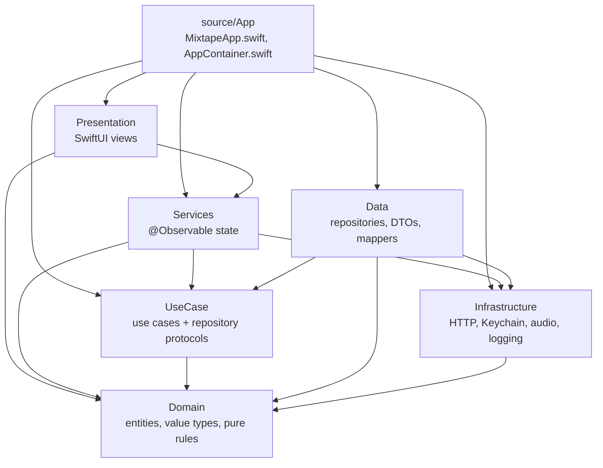
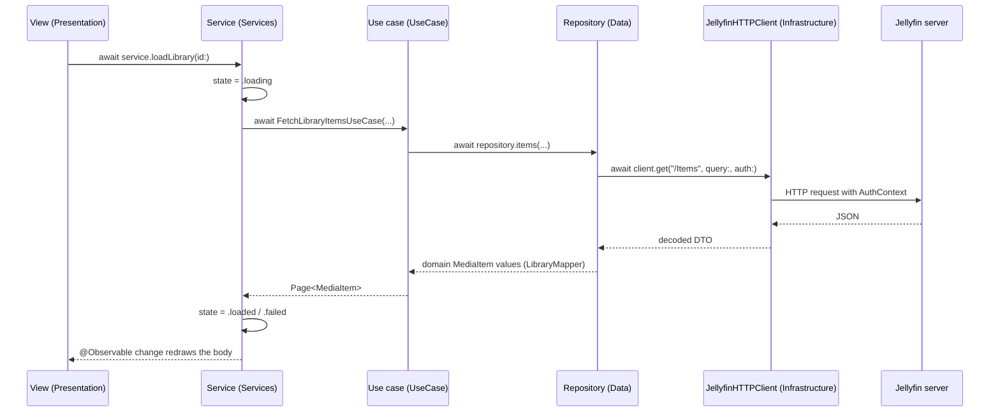

# mixtape — iOS architecture

mixtape is a Jellyfin client for iOS. It connects to one self-hosted Jellyfin server, browses that server's music library, plays albums, and reports playback progress back to the server.

This document describes the architecture as built. `../jellyfin-openapi.json` is the API contract it is built against — the OpenAPI 3.0.1 specification served by the Jellyfin 10.11.11 instance the project targets, pulled from that server's own `/api-docs/openapi.json`.

## Platform and toolchain

| Item | Value |
|---|---|
| Deployment target | iOS 26.1 (`IPHONEOS_DEPLOYMENT_TARGET = 26.1`) |
| Toolchain | Xcode 26, Swift 6.2 |
| Swift language mode | 6 |
| Third-party dependencies | none |
| App target | `Mixtape` — one target over `source/`, built from `MixTape.xcodeproj` directly, no local SPM package |
| Info.plist | `UIBackgroundModes` = `audio`; `NSAppTransportSecurity.NSAllowsArbitraryLoads` = true, because a LAN Jellyfin server on plain HTTP is the normal case |
| Project format | `MixTape.xcodeproj` at `objectVersion = 77` |

## Swift settings — the two toggles that shape the code

Two build settings decide how almost every type in this codebase is written, set at the project level and on each target.

| Setting | Value |
|---|---|
| `SWIFT_DEFAULT_ACTOR_ISOLATION` | `MainActor` |
| `SWIFT_APPROACHABLE_CONCURRENCY` | `NO` |
| `SWIFT_VERSION` | `6.0` |
| `SWIFT_UPCOMING_FEATURE_MEMBER_IMPORT_VISIBILITY` | `YES` |

### What `SWIFT_DEFAULT_ACTOR_ISOLATION = MainActor` buys the MV architecture

Every type is `@MainActor` unless it says otherwise. That is what makes an MV architecture without a ViewModel layer cheap to write:

- SwiftUI views need no isolation annotation. They are already on the main actor.
- The `@Observable` service classes that hold all mutable state need no `@MainActor` attribute either. `SessionService`, `LibraryService`, `ImageService` and `MusicPlayerService` are each written as a plain `@Observable final class`, and the setting supplies the isolation that keeps their `private(set)` state safe to read straight from a view body.
- The layers that must be free of the main actor opt **out** explicitly, one type at a time, with `nonisolated`. Every DTO, every mapper and every repository in `source/Data` carries it — for example `nonisolated struct JellyfinLibraryRepository`, `nonisolated struct BaseItemDTO`, `nonisolated enum LibraryMapper` — as do the value types in `source/Domain` and the `Sendable` helpers in `source/Infrastructure` such as `KeychainStore` and `AuthContext`.

The direction of that default is the whole point: isolation is the norm, and leaving it is a deliberate, visible act at the type that does so.

### What Swift 6 language mode buys

Language mode 6 makes data-race checking complete for the whole build, so `SWIFT_STRICT_CONCURRENCY` is not set anywhere — the language mode already implies it. Consequences visible throughout the code:

- Everything crossing an isolation boundary is `Sendable`. Domain entities and value types are `Sendable` structs and enums with no reference types at all.
- Repositories are stateless `nonisolated` `Sendable` structs, so a use case can call one from any context.
- `SWIFT_APPROACHABLE_CONCURRENCY = NO` keeps the Swift 6.2 upcoming-feature bundle off, `NonisolatedNonsendingByDefault` among them. A `nonisolated async` function — every repository method — therefore runs on the global concurrent executor when a main-actor service awaits it, and that hop is why repositories, and everything they take or return, are `Sendable`.
- Main-actor code leaves the main actor only where it says so. `@concurrent` appears exactly once in the codebase, on the image-decoding function in `source/Services/Images/ImageService.swift` — the one place in the browse path where real CPU work happens.

## The MV rule

There is no ViewModel layer.

- `@Observable` service classes hold state. They are the only place state is written.
- Views read that state through `@Environment` and call service methods to act.
- Views take no use case and no repository in their signatures. A view that needs data shaped differently is a service's job, not the view's.
- The object graph is built once, by hand, in `source/App/AppContainer.swift`. No container, no service locator, no `.shared`.
- Environment wiring uses `@Entry`, one small extension per service in `source/Presentation/Environment/`.

## Six layers, one direction, one target

The six layers used to be six separate SPM library targets under a local package, `MixtapeKit`, with a second app target for tvOS. Both are gone (decisions 52–53) — tvOS moved to `archive/tvOS/`, and the six targets collapsed into six plain folders under `source/`, compiled into the one `Mixtape` app target. The compiler can no longer enforce the folder edges on its own, so `scripts/check-layer-imports.sh` is the backstop — it checks the one part a grep can see, that `Domain` and `UseCase` stay free of UI and platform frameworks. The rest of the edges are on review.

| Folder | Holds | Depends on |
|---|---|---|
| `Domain` | Entities, value types, domain errors, pure rules | Foundation only |
| `UseCase` | One type per use case, repository protocols | `Domain` |
| `Infrastructure` | HTTP client, Keychain, logging, the audio player controller, the audio session | `Domain` |
| `Data` | Repository implementations, DTOs, DTO-to-domain mapping | `UseCase`, `Domain`, `Infrastructure` |
| `Services` | `@Observable` state holders | `UseCase`, `Domain`, `Infrastructure` |
| `Presentation` | SwiftUI views | `Services`, `Domain` |



`Presentation` never imports `Data`, `UseCase` or `Infrastructure`. `UseCase` and `Domain` never import SwiftUI, Observation, UIKit or AVFoundation. `AppContainer.swift` is the one file that sees all six layers, and `scripts/check-layer-imports.sh` exempts only that path.

### Why `Services` sees `Infrastructure`

`MusicPlayerService` owns an `AudioPlayerControlling`. The protocol lives in `source/Infrastructure/Audio/`, and its `makeView`-equivalent surface pins it to a module the service needs directly, so it cannot sit lower in the stack.

## Runtime flow

One request, from a tap to the wire and back into observable state.



Views never see a DTO. `Data` maps every Jellyfin response into `Domain` values at the repository boundary, and `LoadState<Value>` in `Domain` carries idle, loading, loaded and failed uniformly so every screen renders the same four states.

## Composition root

`source/App/AppContainer.swift` builds the graph in one pass — HTTP client, then Keychain store, then repositories, then use cases, then services — and `source/App/MixtapeApp.swift` injects the four services into the environment:

```swift
@main
struct MixtapeApp: App {
    @State private var container = AppContainer()

    var body: some Scene {
        WindowGroup {
            RootScreen()
                .environment(\.sessionService, container.sessionService)
                .environment(\.libraryService, container.libraryService)
                .environment(\.imageService, container.imageService)
                .environment(\.musicPlayerService, container.musicPlayerService)
        }
    }
}
```

The container also wires session teardown. `SessionService` holds no reference to the other services; it exposes an `onSessionEnded` closure, and the container — the only place all six layers are visible — fans sign-out out to the library and music services so each clears its own caches and the player stops.

## Services

Every service is an `@Observable final class` with `private(set)` state.

| Service | State it owns |
|---|---|
| `SessionService` | `state` (loading, signedOut, signedIn), `serverIdentity`, `quickConnect`, `error`, `isBusy`. The only writer of session state and the single handler of an expired session |
| `LibraryService` | `libraries`, a per-library page cache, per-item details and per-album track lists. Pages of 60 items, advanced by `startIndex` |
| `ImageService` | Album-art URLs plus an in-memory `NSCache` capped at 120 MB |
| `MusicPlayerService` | `album`, `queue`, `currentIndex`, `status`, `position`, `finishedAlbumID` |

### The queue is the album

`MusicPlayerService.queue` holds the tracks of exactly one album. `play(album:tracks:startingAt:)` is the only way tracks enter it, and it replaces the queue. When the last track ends, playback stops, the now-playing surface dismisses, and the wallet pages back to the sleeve the album came from and pulses it home. `claimFinish(albumID:)` and `acknowledgeFinish()` hand that navigational event to whichever wallet is on screen.

## Presentation

Views live in `source/Presentation/Screens/<Feature>/`, one view per file, filename matching the type. Cross-screen pieces sit in `Shared/`.

`RootScreen` switches on `SessionService.state`: `SplashScreen` while restoring, `SignInFlow` when signed out, `RootTabScreen` when signed in. `RootTabScreen` carries three tabs — Libraries, Music, Settings — with the mini player docked in the tab bar's bottom accessory whenever music is active, and `NowPlayingScreen` presented as a sheet from that root so it outlives the mini player. A movie or TV library on the server shows as unsupported in the library list rather than being browsable — this app only understands music libraries.

Chrome is Liquid Glass through one modifier. `source/Presentation/Shared/GlassChrome.swift` reads `\.accessibilityReduceTransparency` and paints an opaque background instead of `.glassEffect` when the setting is on; every glass surface goes through it, and `scripts/check-glass-fallback.sh` checks that.

Every screen carries accessibility identifiers, held as constants in `source/Presentation/Identifiers/` — one file per screen.

Every view file has a `#Preview` for its loaded, empty and failure states, driven by `Mock*` types that ship in `Services/Mocks/` for exactly that purpose.

## The Jellyfin API surface

These are the endpoints the app calls. Everything else in `../jellyfin-openapi.json` is contract the app does not touch.

| Endpoint | Method | Used for |
|---|---|---|
| `/System/Info/Public` | GET | Validate a server URL, read its name and id |
| `/QuickConnect/Enabled` | GET | Whether the server offers Quick Connect |
| `/QuickConnect/Initiate` | POST | Start a Quick Connect handshake, get the code |
| `/QuickConnect/Connect` | GET | Poll until the code is authorised |
| `/Users/AuthenticateByName` | POST | Username and password sign-in |
| `/Users/AuthenticateWithQuickConnect` | POST | Exchange an authorised secret for a token |
| `/UserViews` | GET | The user's libraries |
| `/Items` | GET | Browse a library, and album track lists |
| `/Items/{itemId}` | GET | Item detail, with `Overview` and `MediaSources` |
| `/Items/{itemId}/Images/Primary` | GET | Album art |
| `/Audio/{itemId}/universal` | GET | Music stream, native containers |
| `/Audio/{itemId}/main.m3u8` | GET | Music HLS fallback |
| `/Sessions/Playing` | POST | Report playback start |
| `/Sessions/Playing/Progress` | POST | Report progress |
| `/Sessions/Playing/Stopped` | POST | Report stop |

`JellyfinHTTPClient` in `source/Infrastructure/` is the only type that builds a request. It carries the `AuthContext` header, and `RedactingURLs.swift` strips tokens before anything reaches the log.

There is no `/Items/{itemId}/PlaybackInfo` round-trip. Music streaming builds its URL directly: `JellyfinPlaybackRepository.audioStream(track:session:playSessionID:)` asks for the containers Apple platforms decode natively first (`flac,alac,m4a,mp3,aac,wav,aiff`) via `/Audio/{itemId}/universal`, and falls back to `/Audio/{itemId}/main.m3u8` only when the track's container needs it. `IsNativeAudioContainer.swift` in `Domain` is the pure function that decides, unit-tested without any I/O.

## Audio session

`AudioPlayerController` in `source/Infrastructure/Audio/` owns an `AVPlayer` with the `AVAudioSession` `.playback` category, which is what gives background audio alongside the `UIBackgroundModes` entry. It publishes to `MPNowPlayingInfoCenter` and takes commands from `MPRemoteCommandCenter`, so the lock screen and remote controls drive play, pause, next and previous. It observes three notifications: an interruption pauses and resumes according to the option the system supplies, a route change to an unavailable device pauses, and a media-services reset rebuilds the session.

## Enforcement

| Command | Checks |
|---|---|
| `xcodebuild build -project MixTape.xcodeproj -scheme Mixtape -destination 'generic/platform=iOS Simulator'` | Compiles under Swift 6 language mode |
| `xcodebuild test -project MixTape.xcodeproj -scheme Mixtape -skip-testing:MixtapeUITests` | Unit tests |
| `./scripts/check-layer-imports.sh` | Layer edges the compiler can no longer express |
| `./scripts/check-glass-fallback.sh` | Every glass surface reads Reduce Transparency |
| `swiftformat --lint .` | Formatting — currently fails; see the follow-ups in CLAUDE.md |
| `./scripts/gate.sh` | All of the above |

Unit tests use Swift Testing (`@Test`, `@Suite`) and live in `tests/<Layer>/` beside the layer they cover, tagged by layer. Repositories are tested against a stubbed `URLProtocol` with captured JSON fixtures in `tests/Data/Fixtures/`, never a live server. Test doubles are `Mock*` in the main target, for previews, and `Stub*` in the test target.

## Code style

- One type per file. Filename matches the type name.
- One view per file. No `private var header: some View`, no `@ViewBuilder private func`.
- Every view file has a `#Preview` covering loaded, empty and failure states.
- No `fatalError`, `as!` or `try!` without a same-line comment saying why it is unreachable.
- No prefix `!`. Write `x == false`.
- No Combine. `async`/`await`, `AsyncSequence` and Observation cover it.
- Constructor injection only.
- Protocol suffix `*Protocol`.
